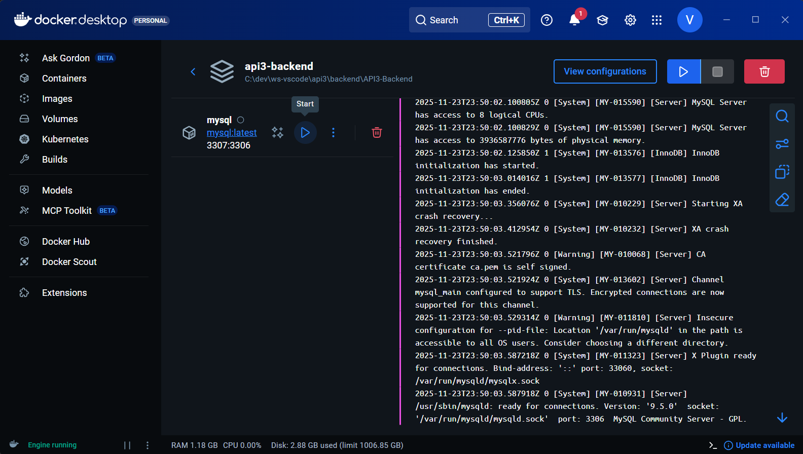

## 📚 Guia de Instalação – *Proficio*

Este guia explica como instalar, configurar e executar **todo o ambiente do projeto**, incluindo **Backend**, **Frontend** e **MySQL com Docker**.

---

### 1. Pré-requisitos

Antes de iniciar, instale:

- **Git**
- **Docker Desktop**
- **Docker Compose**
- **Node.js (LTS)**  
- **Java 21**
- **Maven** (opcional)
- **IntelliJ e Visual Studio Code**

---

### 2. Clonar Repositórios

Clone os repositórios do Back-end e Front-end:

```bash
git clone https://github.com/Concord-API/API3-Backend.git
git clone https://github.com/Concord-API/API3-Frontend.git
```

###  3. Subindo o banco de dados com Docker

O projeto utiliza MySQL rodando em Docker.

Crie um arquivo .env na raiz do backend usando estes valores:
```env
MYSQL_DATABASE=db_proficio
MYSQL_USER=usuario
MYSQL_PASSWORD=123
MYSQL_ROOT_PASSWORD=123
MYSQL_PORT=3307
```
Dentro do Docker Desktop, inicie o Docker compose *api3-backend*.


### 4. Configurar o Backend (API)

Para rodar o backend: Entre na pasta **cd API3-Backend**, pelo **IntelliJ** e execute o *ProficioApplication.java*

### 5. Configurar o Frontend (React + Vite)

Abra o VScode e entre na pasta ```cd API3-Frontend```, instale as dependências ```npm install```, execute o projeto com o comando ```npm run dev```. O frontend abrirá em: http://localhost:5173

**obs:** Lembre-se de alterar o nome do arquivo *.env.examle* para *.env*, e adicionar os campos:
```
VITE_USE_MOCKS=false
VITE_API_URL=http://localhost:8080/api
``` 

